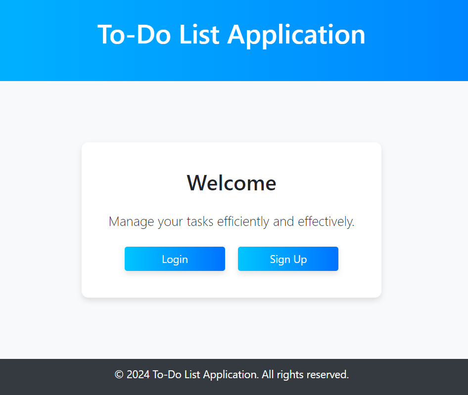
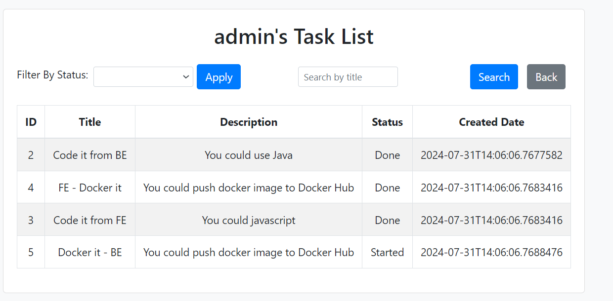
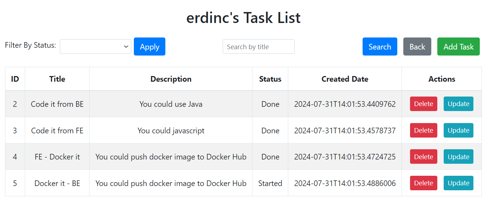
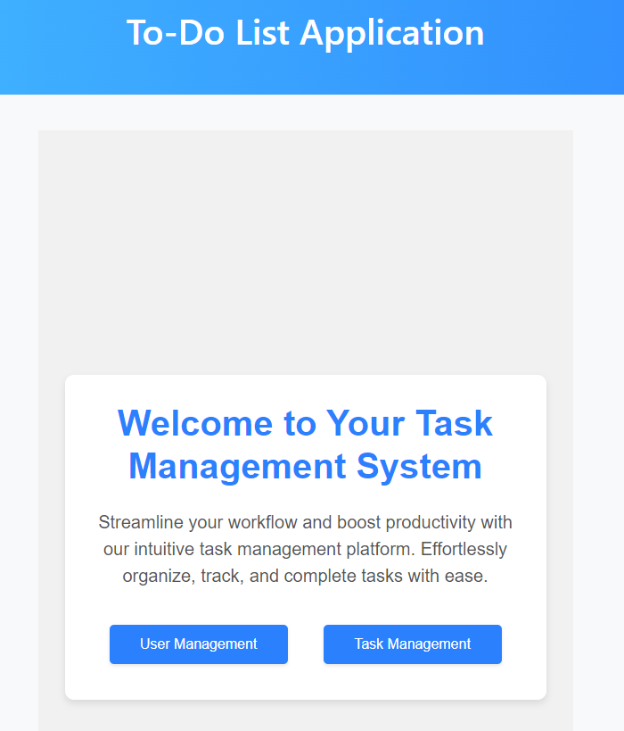

Backend Side :
Spring
Java
Maven
Unit Tests

Swagger : http://localhost:8080/swagger-ui/index.html#/

BaseURL : http://localhost:8080/

CouchBase : http://localhost:8091/

----------------

User Information : userName : admin / password : admin

----------------
User Roles :

Admin :
- Accessing User Management
  -List Users

  -Delete User

  -Change Password
------------------
- Accessing Task Management
  -List All Tasks

  -Filter by status

  -Search by title
----------------------
Other Users :
- Accessing Task Management
  -List By User Tasks

  -Filter by status

  -Search by title

  -Add Task

  -Delete Task

  -Update Task
----------------------
Screen-Shorts: 

Main Screen:

List All with admin user:

List All Task By erdinc user:

Main Dashboard for admin : 

